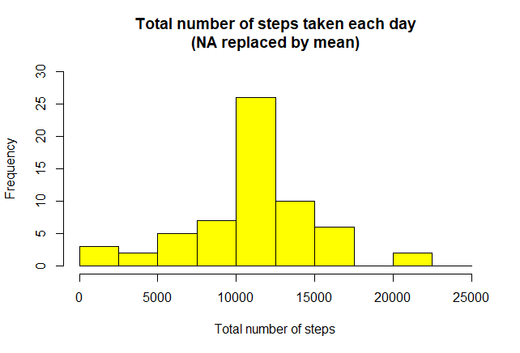
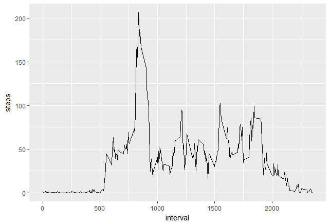
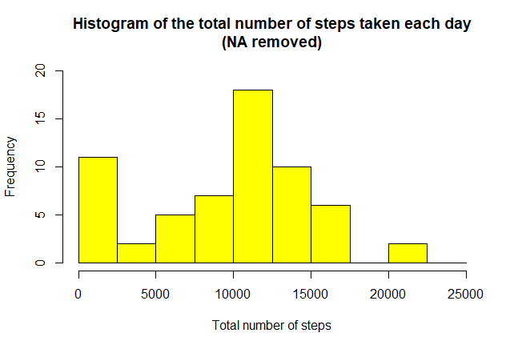
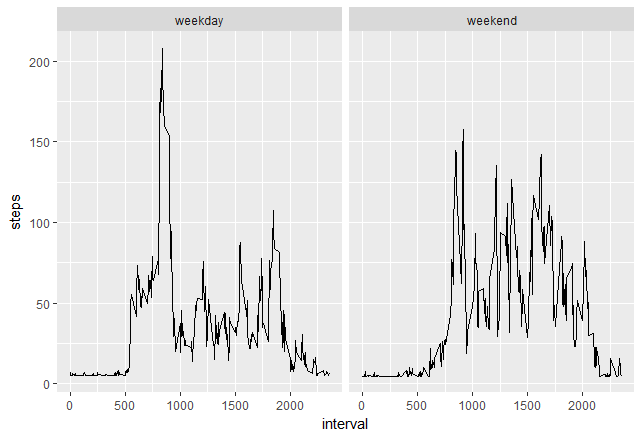

# Reproducible Research: Peer Assessment 1

## Loading and preprocessing the data

```
data <- read.csv(./data/"activity.csv")
data$date<-as.Date(data$date)
```

## What is mean total number of steps taken per day?
1. Create histogram of the total number of steps taken each day.
```
sum_steps<-aggregate(data$steps,by=list(data$date),FUN=sum,na.rm=TRUE) 

hist(sum_steps$x, 
      breaks=seq(from=0, to=25000, by=2500),
      col="yellow", 
      xlab="Total number of steps", 
      ylim=c(0, 20), 
      main="Histogram of the total number of steps taken each day\n(NA removed)")
```

 

2. Calculate and report the mean and median of the total number of steps taken per day.
```
mean(sum_steps$x)
```

```
## [1] 9354.23
```

```
median(sum_steps$x)
```

```
## [1] 10395
```

## What is the average daily activity pattern?

```
avg_steps<-aggregate(data$steps,by=list(data$interval),FUN=mean,na.rm=TRUE)
colnames(avg_steps)<-c("interval","steps")
```
1. Create the time series plot
```
library(ggplot2)
ggplot(aes(x=interval,y=steps),data=avg_steps)+geom_line()
```

 

2. For average across all the days in the dataset, the 5-minute interval contains
the maximum number of steps?

```
avg_steps[avg_steps$steps==max(avg_steps$steps),1]
```

```
## [1] 835
```
```
sum(is.na(data$steps))
```
```
## [1] 2304
```
## Imputing missing values

There are many days/intervals where there are missing values (coded as `NA`). The presence of missing days may introduce bias into some calculations or summaries of the data.


```
data$steps[is.na(data$steps)]<-mean(data$steps,na.rm=TRUE)
head(data)
```

```
    steps       date interval
1 37.3826 2012-10-01        0
2 37.3826 2012-10-01        5
3 37.3826 2012-10-01       10
4 37.3826 2012-10-01       15
5 37.3826 2012-10-01       20
6 37.3826 2012-10-01       25
```

4. Using the filled data set, make a histogram of the total number of steps taken each day.

```
sum_steps<-aggregate(data$steps,by=list(data$date),FUN=sum,na.rm=TRUE) 

hist(sum_steps$x, 
    breaks=seq(from=0, to=25000, by=2500),
    col="yellow", 
    xlab="Total number of steps", 
    ylim=c(0, 30), 
    main="Total number of steps taken each day\n(NA replaced by mean)")
```

 

5. Calculate the mean and median total number of steps.
```
mean(total.steps)
```

```
## [1] 10766.19
```

```
median(total.steps)
```

```
## [1] 10766.19
```

Mean and median values are higher after imputing missing data. The reason is
that in the original data, there are some days with `steps` values `NA` for 
any `interval`. The total number of steps taken in such days are set to 0s by
default. However, after replacing missing `steps` values with the mean `steps`
of associated `interval` value, these 0 values are removed from the histogram
of total number of steps taken each day.

## Are there differences in activity patterns between weekdays and weekends?
1. Convert date into weekdays
```
data$days=tolower(weekdays(data$date))
```
2. Now categorised days into weekend and weekdays
```
data$day_type<-ifelse(data$days=="saturday"|data$days=="sunday","weekend","weekday")
```
3. Take mean steps taken on weekend or weekday in the intervals
```
avg_steps<-aggregate(data$steps,by=list(data$interval,data$day_type),FUN=mean,na.rm=TRUE)
colnames(avg_steps)<-c("interval","day_type","steps")
```
4. Create the panel plot between the average steps and interval by day type

```
ggplot(aes(x=interval,y=steps),data=avg_steps)+
    geom_line()+
    facet_wrap(~avg_steps$day_type)
```
 
